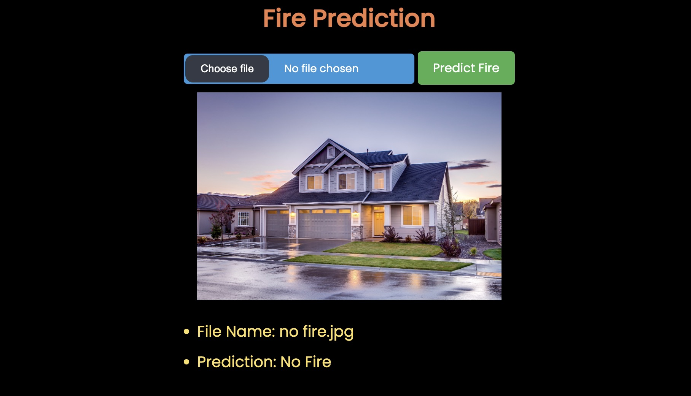

<h1>Fire Prediction Using CV</h1>

We can use this website to predict fire in an image</h2>

<h2>Technologies Used</h2>

<ul align="center">
 

 
</ul><h2>Features</h2>

<ul>
<li>Big Dataset</li>
</ul><ul>
<li>Mobile Responsive</li>
</ul><ul>
<li>Simple UI</li>
</ul><h2>Screenshots</h2>

<h2>Contributor</h2>

<a href="https://github.com/sukanyasingh3">@sukanyasingh3</a> - CV Prediction Model

<h2>Setup</h2>

Required Installation: Check the requirements.txt
<h5>Steps</h5><ul>
<li>To download <code>git clone https://github.com/TartejBrothers/CV-Fire-Predict-Website.git</code></li>
</ul><ul>
<li>To run 
 <code>cd CV-Fire-Predict-Website</code>
 
<code>django manage.py runserver</code></li>
</ul><h2>Improvements</h2>

<ul>
<li>UI of the home page</li>
</ul><ul>
<li>UI for the result</li>
</ul><h2>Contact</h2>

